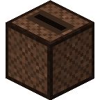
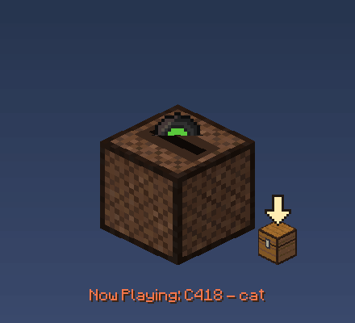
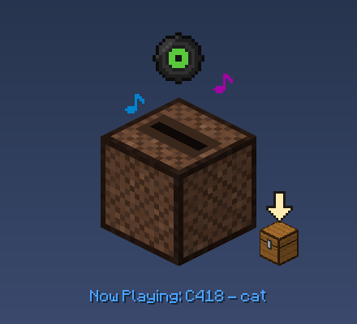
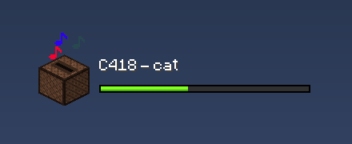
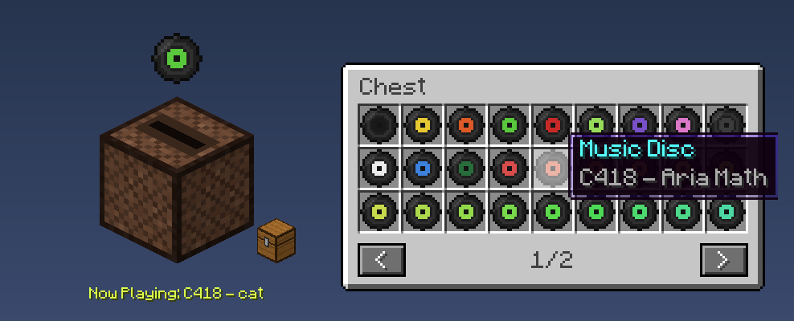

<div align="center">



# Jukebox

**A Minecraft jukebox that sits on your Linux desktop and plays C418's music when you click it.**

Click it, a disc rises out of the jukebox and *Now Playing: C418 - cat* fades in, just like in the game.




**English** · [Français](README.fr.md)

</div>

---

## Features

- 🎵 **44 C418 tracks**: the 12 music discs and the background music, taken from *your own* Minecraft install.
- 💿 **Faithful to the game**: the disc rises out of the slot, the *Now Playing* message uses the Minecraft font and fades through the rainbow, and music notes pop out while it plays.
- 📦 **Disc chest**: click the small chest next to the jukebox to open a Minecraft chest full of music discs, one per track, each with its own colour. Hover a disc for the in-game tooltip, click it to play that track.
- 🔁 **Autoplay**: when a track ends, another random one starts.
- 🔊 **Volume with the mouse wheel**: scroll over the jukebox. The notes get bigger and more frequent as it gets louder.
- 🖱️ **Put it anywhere**: drag it around the desktop.
- 🪟 **A real desktop widget**: transparent background, stays under your apps, and clicks on empty areas go through it.
- 📏 **Compact mode**: after 10 s without interaction it shrinks to a small jukebox with the title and an experience-style progress bar. Hover it to bring it back.
- 🎨 **Drawn by code**: every pixel comes from `textures.py`, so no game texture is shipped.

<table>
<tr>
<td align="center"><br><sub>Normal mode</sub></td>
<td align="center"><br><sub>Compact mode</sub></td>
</tr>
<tr>
<td align="center" colspan="2"><br><sub>Disc chest</sub></td>
</tr>
</table>

## Requirements

- **Linux** with an X11 session, or Wayland with XWayland (the default on GNOME and KDE).
- **Python 3.10+**. On Debian/Ubuntu also install `python3-venv`.
- **Minecraft Java Edition**, launched at least once, so its music is on your disk. The official launcher (native or Flatpak) and Prism Launcher are detected automatically.
- The free **[Minecraftia](https://www.dafont.com/minecraftia.font)** font.

## Install

```bash
git clone https://github.com/boomer24vs/jukebox.git
cd jukebox
./install.sh
```

The script:
1. creates a Python environment in `.venv/` and installs the dependencies;
2. copies the C418 music from your Minecraft install into `sounds/`;
3. checks the font;
4. adds **Jukebox** to your application menu.

Then download [Minecraftia](https://www.dafont.com/minecraftia.font) and put `Minecraftia-Regular.ttf` in the `fonts/` folder.

> Minecraft installed somewhere unusual? Pass its `assets` folder: `./install.sh /path/to/.minecraft/assets`

## Usage

Launch **Jukebox** from your application menu, or run `.venv/bin/python jukebox.py`.

| Action | Effect |
|---|---|
| Left click on the jukebox | Plays a random track (another click switches track) |
| Left click on the small chest | Opens / closes the disc chest |
| Left click on a disc in the chest | Plays that track and closes the chest |
| Mouse wheel on the jukebox | Volume, by steps of 10% |
| Drag | Moves the jukebox |
| `Esc` | Closes the chest if it is open, otherwise quits |
| Right click on the jukebox | Quits |
| 10 s without interaction | Compact mode; hover it to bring back the normal mode |

## Settings

Everything is tuned in the `PRESET` dictionary at the top of [`jukebox.py`](jukebox.py). For example:

```python
"window_layer": "below",      # "below" (under your apps), "normal" or "top" (always on top)
"window_top_margin": 40,      # starting distance from the top of the screen
"volume_default": 0.7,
"autoplay": True,             # a new random track starts when one ends
"compact_delay": 10.0,        # seconds before compact mode
"compact_transition": 0.8,
```

## Troubleshooting

| Problem | Fix |
|---|---|
| `No audio file in sounds/` | Launch Minecraft Java once, then run `.venv/bin/python extract_music.py` |
| `No Minecraft assets found` | Pass the assets folder: `.venv/bin/python extract_music.py /path/to/assets` |
| `Font missing` | Put `Minecraftia-Regular.ttf` in `fonts/` |
| Grey square around the jukebox | Your session has no compositor or no 32-bit visual: transparency is not available |
| Window does not open on pure Wayland | XWayland is required (it is on by default on GNOME and KDE) |

Tested on Fedora 43 with GNOME 49 (Wayland + XWayland). Other desktops should work but have not been tested yet: issues are welcome.

## Uninstall

```bash
rm ~/.local/share/applications/jukebox.desktop
rm -rf /path/to/jukebox
```

## Project layout

| File | Role |
|---|---|
| `jukebox.py` | Window, main loop, animations, settings (`PRESET`) |
| `textures.py` | Procedural pixel art: jukebox, discs, notes, chest and its GUI |
| `player.py` | Audio: random or chosen track, volume, progress |
| `extract_music.py` | Copies the C418 music from your Minecraft install |
| `install.sh` | One-step install |

## Legal

- **Not an official Minecraft product. Not approved by or associated with Mojang or Microsoft.**
- The music is © C418 / Mojang. It is **not** in this repository: `extract_music.py` copies it from the Minecraft install you own, on your machine.
- The Minecraftia font is by Andrew Tyler and is **not** included. Download it from dafont and check its license there.
- The code is under the [MIT license](LICENSE).
